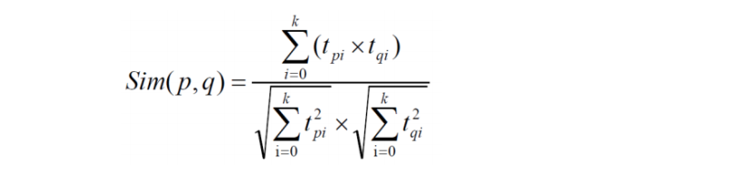

# 数据加载模块

```
2020-07-26 15:17:20,044   INFO --- [                                              main]  com.mongodb.spark.connection.MongoClientCache                                   (line:   48)  :  Creating MongoClient: [192.168.17.140:27017]
ERROR StatusLogger Log4j2 could not find a logging implementation. Please add log4j-core to the classpath. Using SimpleLogger to log to the console...
(使用的 es 地址是：,192.168.17.140,9300)
[Stage 5:>                                                       (2 + 12) / 200]2020-07-26 15:17:26,720   INFO --- [                                  pool-17-thread-1]  com.mongodb.spark.connection.MongoClientCache                                   (line:   48)  :  Closing MongoClient: [192.168.17.140:27017]
```

## ES

```
docker run  -p 9200:9200 -p 9300:9300 --name='es' -d  -v /home/k8s-develop/movie/elasticsearch.yml:/usr/share/elasticsearch/config/elasticsearch.yml elasticsearch:5.6.8

docker exec -it es /bin/bash    #进入交互模式，es必须先启动

sudo vim /etc/sysctl.conf

vm.max_map_count=655360

docker rm $(docker ps -q -f status=exited)
```

elasticsearch.yml

```yaml
http.host: 0.0.0.0
# Uncomment the following lines for a production cluster deployment
transport.host: 0.0.0.0
#discovery.zen.minimum_master_nodes: 1
```

运行 DataLoader 后校验运行结果

curl http://192.168.17.140:9200/

```json
{
  "name" : "pYkk1Sm",
  "cluster_name" : "elasticsearch",
  "cluster_uuid" : "Aoy9VQPpSk62trl1m0T4KA",
  "version" : {
    "number" : "5.6.8",
    "build_hash" : "688ecce",
    "build_date" : "2018-02-16T16:46:30.010Z",
    "build_snapshot" : false,
    "lucene_version" : "6.6.1"
  },
  "tagline" : "You Know, for Search"
}
```

curl http://192.168.17.140:9200/recommender/_search?pretty

```json
{
  "took" : 5,
  "timed_out" : false,
  "_shards" : {
    "total" : 5,
    "successful" : 5,
    "skipped" : 0,
    "failed" : 0
  },
  "hits" : {
    "total" : 2791,
    "max_score" : 1.0,
    "hits" : [
      {
        "_index" : "recommender",
        "_type" : "Movie",
        "_id" : "2542",
        "_score" : 1.0,
        "_source" : {
          "mid" : 2542,
          "name" : "Lock, Stock & Two Smoking Barrels (1998)",
          "describe" : "A card sharp and his unwillingly-enlisted friends need to make a lot of cash quick after losing a sketchy poker match. To do this they decide to pull a heist on a small-time gang who happen to be operating out of the flat next door.",
          "timeLong" : "105 minutes",
          "issue" : "August 31, 1999",
          "shoot" : "1998",
          "language" : "English",
          "genres" : "Comedy|Crime|Thriller",
          "actors" : "Jason Flemyng|Dexter Fletcher|Nick Moran|Jason Statham|Vinnie Jones|Sting|Steven Mackintosh|Nicholas Rowe|Lenny McLean|P.H. Moriarty|Frank Harper|Huggy Leaver|Stephen Marcus|Peter McNicholl|Nick Marcq|Tony McMahon|Steve Sweeney|Charles Forbes|Vas Blackwood|Jake Abraham|Victor McGuire|Danny John-Jules|Elwin 'Chopper' David|Vera Day|Rob Brydon|Alan Ford|Andrew Tiernan|Jason Flemyng|Dexter Fletcher|Nick Moran|Jason Statham|Vinnie Jones",
          "directors" : "Guy Ritchie",
          "tags" : "organized crime|dark comedy|Guy Ritchie"
        }
      },
      {
        "_index" : "recommender",
        "_type" : "Movie",
        "_id" : "3062",
        "_score" : 1.0,
        "_source" : {
          "mid" : 3062,
          "name" : "Longest Day, The (1962)",
          "describe" : "The retelling of June 6, 1944, from the perspectives of the Germans, US, British, Canadians, and the Free French. Marshall Erwin Rommel, touring the defenses being established as part of the Reich's Atlantic Wall, notes to his officers that when the Allied invasion comes they must be stopped on the beach. 'For the Allies as well as the Germans, it will be the longest day'",
          "timeLong" : "178 minutes",
          "issue" : "November 2, 1999",
          "shoot" : "1962",
          "language" : "English|Français|Deutsch",
          "genres" : "Action|Drama|War",
          "actors" : "Eddie Albert|Paul Anka|Arletty|Jean-Louis Barrault|Richard Beymer|Hans Christian Blech|Bourvil|Richard Burton|Wolfgang Büttner|Red Buttons|Sean Connery|Ray Danton|Pauline Carton|Armin Dahlen|Mark Damon|Richard Dawson|Irina Demick|Fred Dur|Fabian|Mel Ferrer|Frank Finlay|Henry Fonda|Steve Forrest|Bernard Fox|Robert Freitag|Bernard Fresson|Gert Fröbe|Lutz Gabor|Arnold Gelderman|Leo Genn|Harold Goodwin|Walter Gotell|Henry Grace|John Gregson|Clément Harari|Paul Hartmann|Ruth Hausmeister|Jack Hedley|Michael Hinz|Werner Hinz|Donald Houston|Jeffrey Hunter|Karl John|Curd Jürgens|Til Kiwe|Alexander Knox|Peter Lawford|Wolfgang Lukschy|Christian Marquand|Roddy McDowall|Sal Mineo|Robert Mitchum|Kenneth More|Richard Münch|Edmond O'Brien|Leslie Phillips|Wolfgang Preiss|Heinz Reincke|Madeleine Renaud|Robert Ryan|Dietmar Schönherr|Ernst Schröder|George Segal|Jean Servais|Hans Söhnker|Rod Steiger|Richard Todd|Tom Tryon|Peter van Eyck|Vicco von Bülow |Robert Wagner|John Wayne|Stuart Whitman|Eddie Albert|Paul Anka|Arletty|Jean-Louis Barrault|Richard Beymer",
          "directors" : "Bernhard Wicki|Ken Annakin|Andrew Marton"
        }
      },
      {
        "_index" : "recommender",
        "_type" : "Movie",
        "_id" : "2971",
        "_score" : 1.0,
        "_source" : {
          "mid" : 2971,
          "name" : "All That Jazz (1979)",
          "describe" : "Bob Fosse's semi-autobiographical film celebrates show business stripped of glitz or giddy illusions. Joe Gideon (Roy Scheider) is at the top of the heap, one of the most successful directors and choreographers in musical theatre. But he can feel his world slowly collapsing around him--his obsession with work has almost destroyed his personal life, and only his bottles of pills keep him going.",
          "timeLong" : "123 minutes",
          "issue" : "August 19, 2003",
          "shoot" : "1979",
          "language" : "English",
          "genres" : "Drama|Fantasy|Musical",
          "actors" : "Roy Scheider|Jessica Lange|Leland Palmer|Ann Reinking|Ben Vereen|Cliff Gorman|Erzsebet Foldi|Michael Tolan|Max Wright|William LeMassena|Irene Kane|Deborah Geffner|Kathryn Doby|Anthony Holland|Robert Hitt|David Margulies|Sue Paul|Keith Gordon|Frankie Man|Alan Heim|John Lithgow|Sandahl Bergman|CCH Pounder|Wallace Shawn|Roy Scheider|Jessica Lange|Leland Palmer|Ann Reinking|Ben Vereen",
          "directors" : "Bob Fosse"
        }
      },
      {
        "_index" : "recommender",
        "_type" : "Movie",
        "_id" : "3087",
        "_score" : 1.0,
        "_source" : {
          "mid" : 3087,
          "name" : "Scrooged (1988)",
          "describe" : "In this modern take on Charles Dickens' 'A Christmas Carol,' Frank Cross (Bill Murray) is a wildly successful television executive whose cold ambition and curmudgeonly nature has driven away the love of his life, Claire Phillips (Karen Allen). But after firing a staff member, Eliot Loudermilk (Bobcat Goldthwait), on Christmas Eve, Frank is visited by a series of ghosts who give him a chance to re-evaluate his actions and right the wrongs of his past.",
          "timeLong" : "101 minutes",
          "issue" : "November 9, 1999",
          "shoot" : "1988",
          "language" : "English",
          "genres" : "Comedy|Fantasy|Romance",
          "actors" : "Bill Murray|Karen Allen|John Forsythe|Bobcat Goldthwait|Carol Kane|Robert Mitchum|Michael J. Pollard|Alfre Woodard|John Glover|David Johansen|Nicholas Phillips|Mabel King|John Murray|Wendie Malick|Brian Doyle-Murray|Joel Murray|Delores Hall|Jamie Farr|Buddy Hackett|Robert Goulet|John Houseman|Lee Majors|Mary Lou Retton|Maria Riva|Anne Ramsey|Sydna Scott|Miles Davis|Larry Carlton|David Sanborn|Paul Schaffer|Mary Ellen Trainor|Al 'Red Dog' Weber|Robert Hammond|Susan Isaacs|Bill Murray|Karen Allen|John Forsythe|Bobcat Goldthwait|Carol Kane",
          "directors" : "Richard Donner"
        }
      },
      {
        "_index" : "recommender",
        "_type" : "Movie",
        "_id" : "2200",
        "_score" : 1.0,
        "_source" : {
          "mid" : 2200,
          "name" : "Under Capricorn (1949)",
          "describe" : "In 1831, Irishman Charles Adare travels to Australia to start a new life with the help of his cousin who has just been appointed governor. When he arrives he meets powerful landowner and ex-convict Sam Flusky, who wants to do a business deal with him. Whilst attending a dinner party at Flusky's house, Charles meets Flusky's wife Henrietta who he had known as a child back in Ireland. Henrietta is an alcoholic and seems to be on the verge of madness.",
          "timeLong" : "108 minutes",
          "issue" : "June 17, 2003",
          "shoot" : "1949",
          "language" : "English",
          "genres" : "Drama",
          "actors" : "Ingrid Bergman|Joseph Cotten|Michael Wilding|Margaret Leighton|Cecil Parker|Denis O'Dea|Jack Watling|Harcourt Williams|John Ruddock|Bill Shine|Victor Lucas|Alfred Hitchcock|Ingrid Bergman|Joseph Cotten|Michael Wilding|Margaret Leighton|Cecil Parker",
          "directors" : "Alfred Hitchcock"
        }
      },
      {
        "_index" : "recommender",
        "_type" : "Movie",
        "_id" : "103221",
        "_score" : 1.0,
        "_source" : {
          "mid" : 103221,
          "name" : "Not Suitable for Children (2012)",
          "describe" : "A young playboy who learns he has one month until he becomes infertile sets out to procreate as much as possible.",
          "timeLong" : "97 minutes",
          "issue" : "",
          "shoot" : "2012",
          "language" : "English",
          "genres" : "Comedy|Romance",
          "actors" : "Ryan Kwanten|Bojana Novaković|Laura Brent|Alice Parkinson|Sarah Snook|Ryan Corr|Ryan Kwanten|Bojana Novaković|Laura Brent|Alice Parkinson|Sarah Snook",
          "directors" : "Peter Templeman"
        }
      },
      {
        "_index" : "recommender",
        "_type" : "Movie",
        "_id" : "1591",
        "_score" : 1.0,
        "_source" : {
          "mid" : 1591,
          "name" : "Spawn (1997)",
          "describe" : "After being murdered by corrupt colleagues in a covert government agency, Al Simmons (Michael Jai White) makes a pact with the devil to be resurrected to see his beloved wife Wanda (Theresa Randle). In exchange for his return to Earth, Simmons agrees to lead Hell's Army in the destruction of mankind.",
          "timeLong" : "96 minutes",
          "issue" : "January 6, 1998",
          "shoot" : "1997",
          "language" : "English",
          "genres" : "Action|Adventure|Sci-Fi|Thriller",
          "actors" : "Michael Jai White|Martin Sheen|John Leguizamo|Theresa Randle|Nicol Williamson|D. B. Sweeney|Melinda Clarke|Miko Hughes|Sydni Beaudoin|Frank Welker|Michael Jai White|Martin Sheen|John Leguizamo|Theresa Randle|Nicol Williamson",
          "directors" : "Mark A.Z. Dippé"
        }
      },
      {
        "_index" : "recommender",
        "_type" : "Movie",
        "_id" : "1645",
        "_score" : 1.0,
        "_source" : {
          "mid" : 1645,
          "name" : "Devil's Advocate, The (1997)",
          "describe" : "A hotshot lawyer gets more than he bargained for when he learns his new boss is Lucifer himself.",
          "timeLong" : "144 minutes",
          "issue" : "December 1, 1998",
          "shoot" : "1997",
          "language" : "English|Français|Deutsch|Italiano|普通话|Español",
          "genres" : "Drama|Mystery|Thriller",
          "actors" : "Keanu Reeves|Al Pacino|Charlize Theron|Jeffrey Jones|Judith Ivey|Connie Nielsen|Craig T. Nelson|Tamara Tunie|Ruben Santiago-Hudson|Debra Monk|Vyto Ruginis|Laura Harrington|Pamela Gray|George Wyner|Chris Bauer|Connie Embesi|Jonathan Cavallary|Heather Matarazzo|Murphy Guyer|Leo Burmester|Bill Moor|Neal Jones|Eddie Aldridge|Mark Deakins|Rony Clanton|George O. Gore II|Alan Manson|Brian Poteat|Daniel Oreskes|Kim Chan|Caprice Benedetti|Don King|Ray Garvey|Rocco Musacchia|Susan Kellermann|James Saito|Harsh Nayyar|Mohammed Ghaffari|Nicki Cochrane|Fenja Klaus|Gino Lucci|Novella Nelson|Vincent Laresca|Benny Nieves|Franci Leary|Monica Keena|Gloria Lynne Henry|Keanu Reeves|Al Pacino|Charlize Theron|Jeffrey Jones|Judith Ivey",
          "directors" : "Taylor Hackford"
        }
      },
      {
        "_index" : "recommender",
        "_type" : "Movie",
        "_id" : "1959",
        "_score" : 1.0,
        "_source" : {
          "mid" : 1959,
          "name" : "Out of Africa (1985)",
          "describe" : "Out of Africa tells the story of the life of Danish author Karen Blixen, who at the beginning of the 20th century moved to Africa to build a new life for herself. The film is based on the autobiographical novel by Karen Blixen from 1937.",
          "timeLong" : "161 minutes",
          "issue" : "February 29, 2000",
          "shoot" : "1985",
          "language" : "English|Kiswahili",
          "genres" : "Drama|Romance",
          "actors" : "Meryl Streep|Robert Redford|Klaus Maria Brandauer|Michael Kitchen|Malick Bowens|Joseph Thiaka|Stephen Kinyanjui|Michael Gough|Suzanna Hamilton|Rachel Kempson|Graham Crowden|Leslie Phillips|Mike Bugara|Shane Rimmer|Job Seda|Mohammed Umar|Iman|Meryl Streep|Robert Redford|Klaus Maria Brandauer|Michael Kitchen|Malick Bowens",
          "directors" : "Sydney Pollack"
        }
      },
      {
        "_index" : "recommender",
        "_type" : "Movie",
        "_id" : "2366",
        "_score" : 1.0,
        "_source" : {
          "mid" : 2366,
          "name" : "King Kong (1933)",
          "describe" : "An adventure film about a film crew in search of a monster on a remote island. The crew finds King Kong and decides to take him back to New York as a money making spectacle. The film is a masterpiece of Stop-Motion in filmmaking history and inspired a line of King Kong films.",
          "timeLong" : "100 minutes",
          "issue" : "November 22, 2005",
          "shoot" : "1933",
          "language" : "English",
          "genres" : "Action|Adventure|Fantasy|Horror",
          "actors" : "Robert Armstrong|Fay Wray|Bruce Cabot|Frank Reicher|Victor Wong|James Flavin|Sam Hardy|Noble Johnson|Steve Clemente|Bill Williams|Dick Curtis|Roscoe Ates|Merian C. Cooper|Ernest B. Schoedsack|Robert Armstrong|Fay Wray|Bruce Cabot|Frank Reicher|Victor Wong",
          "directors" : "Merian C. Cooper|Ernest B. Schoedsack"
        }
      }
    ]
  }
}
```

## Mongo

```
docker run --name mongo -p 27017:27017 -d mongo

docker ps -a
```

## 结果

```shell script
k8s-develop@ubuntu:~/movie$ docker ps -a
CONTAINER ID        IMAGE                 COMMAND                  CREATED             STATUS              PORTS                                            NAMES
4163257ed28b        elasticsearch:5.6.8   "/docker-entrypoint.…"   14 minutes ago      Up 14 minutes       0.0.0.0:9200->9200/tcp, 0.0.0.0:9300->9300/tcp   es
f2e35a3bcd8d        mongo                 "docker-entrypoint.s…"   19 minutes ago      Up 19 minutes       0.0.0.0:27017->27017/tcp                         mongo
```

## Redis

```
docker run  -d --name redis -p 6379:6379 redis:4.0.2

docker ps -a

docker exec -it redis  bash

root@efc549d33e89:/data# redis-
redis-benchmark  redis-check-aof  redis-check-rdb  redis-cli        redis-sentinel   redis-server     

redis-cli

lpush uid:2 261:4.0 265:5.0 266:5.0 272:3.0 273:4.0 292:3.0 296:4.0 300:3.0

127.0.0.1:6379> keys *
(empty list or set)
127.0.0.1:6379> lpush uid:2 261:4.0 265:5.0 266:5.0 272:3.0 273:4.0 292:3.0 296:4.0 300:3.0
(integer) 8
127.0.0.1:6379> keys *
1) "uid:2"
127.0.0.1:6379> lrange uid:2 0 -1
1) "300:3.0"
2) "296:4.0"
3) "292:3.0"
4) "273:4.0"
5) "272:3.0"
6) "266:5.0"
7) "265:5.0"
8) "261:4.0"
127.0.0.1:6379>
```

## zookeeper

```

```

## kafka

```
192.168.17.240 192.168.17.240 192.168.17.240 

./bin/kafka-server-start.sh -daemon ./config/server.properties
```

# 数据离线模块

```
2020-07-26 15:24:41,346   INFO --- [                                              main]  com.mongodb.spark.connection.MongoClientCache                                   (line:   48)  :  Creating MongoClient: [192.168.17.140:27017]
2020-07-26 15:24:45,337   INFO --- [                                              main]  com.mongodb.spark.sql.MongoRelation                                             (line:   48)  :  requiredColumns: mid, filters: 
                                                                                2020-07-26 15:24:47,761   INFO --- [                                              main]  com.mongodb.spark.sql.MongoRelation                                             (line:   48)  :  requiredColumns: mid, timestamp, filters: 
[Stage 7:======================>                                (81 + 12) / 200]2020-07-26 15:24:54,203   INFO --- [                                  pool-17-thread-1]  com.mongodb.spark.connection.MongoClientCache                                   (line:   48)  :  Closing MongoClient: [192.168.17.140:27017]
[Stage 7:======================================================>(197 + 3) / 200]2020-07-26 15:24:58,195   INFO --- [          Executor task launch worker for task 610]  com.mongodb.spark.connection.MongoClientCache                                   (line:   48)  :  Creating MongoClient: [192.168.17.140:27017]
2020-07-26 15:24:58,208   INFO --- [          Executor task launch worker for task 608]  com.mongodb.spark.connection.MongoClientCache                                   (line:   48)  :  Creating MongoClient: [192.168.17.140:27017]
2020-07-26 15:24:58,209   INFO --- [          Executor task launch worker for task 608]  com.mongodb.spark.connection.MongoClientCache                                   (line:   48)  :  Closing MongoClient: [192.168.17.140:27017]
                                                                                2020-07-26 15:25:00,046   INFO --- [                                              main]  com.mongodb.spark.sql.MongoRelation                                             (line:   48)  :  requiredColumns: mid, score, filters: 
2020-07-26 15:25:01,093   INFO --- [                                              main]  com.mongodb.spark.sql.MongoRelation                                             (line:   48)  :  requiredColumns: _id, actors, describe, directors, genres, issue, language, mid, name, shoot, timeLong, filters: IsNotNull(mid)
2020-07-26 15:25:01,117   INFO --- [                                              main]  com.mongodb.spark.sql.MongoRelation                                             (line:   48)  :  requiredColumns: mid, score, filters: IsNotNull(mid)
[Stage 13:==========>                                         (464 + 12) / 2400]2020-07-26 15:25:07,575   INFO --- [                                  pool-17-thread-1]  com.mongodb.spark.connection.MongoClientCache                                   (line:   48)  :  Closing MongoClient: [192.168.17.140:27017]
[Stage 13:=================================================> (2343 + 12) / 2400]2020-07-26 15:25:16,129   INFO --- [         Executor task launch worker for task 3457]  com.mongodb.spark.connection.MongoClientCache                                   (line:   48)  :  Creating MongoClient: [192.168.17.140:27017]
                                                                                2020-07-26 15:25:22,599   INFO --- [                                         Thread-14]  com.mongodb.spark.connection.MongoClientCache                                   (line:   48)  :  Closing MongoClient: [192.168.17.140:27017]

Process finished with exit code 0
```

运行数据离线模块服务后，查看结果

docker exec -it mongo /bin/bash

```
> show databases;
admin        0.000GB
config       0.000GB
local        0.000GB
recommender  0.005GB
> use recommender
switched to db recommender
> show tables;
AverageMovies
GenresTopMovies
Movie
RateMoreMovies
RateMoreRecentlyMovies
Rating
Tag
> db.AverageMovies.findOne()
{
	"_id" : ObjectId("5f19b6e37f2f925a7c455f91"),
	"mid" : 2542,
	"avg" : 4.128378378378378
}
> db.GenresTopMovies.findOne()
{
	"_id" : ObjectId("5f19b6ea7f2f925a7c456a12"),
	"genres" : "Western",
	"recs" : [
		{
			"mid" : 1254,
			"score" : 4.3
		},
		{
			"mid" : 1209,
			"score" : 4.21875
		},
		{
			"mid" : 1304,
			"score" : 4.173333333333333
		},
		{
			"mid" : 3037,
			"score" : 4.166666666666667
		},
		{
			"mid" : 1283,
			"score" : 4.119047619047619
		},
		{
			"mid" : 2070,
			"score" : 4.038461538461538
		},
		{
			"mid" : 26258,
			"score" : 4
		},
		{
			"mid" : 106762,
			"score" : 4
		},
		{
			"mid" : 1181,
			"score" : 4
		},
		{
			"mid" : 2055,
			"score" : 4
		}
	]
}
> 
```

# 离线推荐模块

```
2020-07-26 15:27:07,917   INFO --- [                                              main]  com.mongodb.spark.connection.MongoClientCache                                   (line:   48)  :  Creating MongoClient: [192.168.17.140:27017]
2020-07-26 15:27:10,182   INFO --- [                                              main]  com.mongodb.spark.sql.MongoRelation                                             (line:   48)  :  requiredColumns: mid, score, timestamp, uid, filters: 
2020-07-26 15:27:12,296   WARN --- [           Executor task launch worker for task 31]  com.github.fommil.netlib.BLAS                                                   (line:   61)  :  Failed to load implementation from: com.github.fommil.netlib.NativeSystemBLAS
2020-07-26 15:27:12,297   WARN --- [           Executor task launch worker for task 31]  com.github.fommil.netlib.BLAS                                                   (line:   61)  :  Failed to load implementation from: com.github.fommil.netlib.NativeRefBLAS
2020-07-26 15:27:12,659   WARN --- [           Executor task launch worker for task 52]  com.github.fommil.netlib.LAPACK                                                 (line:   61)  :  Failed to load implementation from: com.github.fommil.netlib.NativeSystemLAPACK
2020-07-26 15:27:12,660   WARN --- [           Executor task launch worker for task 52]  com.github.fommil.netlib.LAPACK                                                 (line:   61)  :  Failed to load implementation from: com.github.fommil.netlib.NativeRefLAPACK
2020-07-26 15:27:16,343   INFO --- [                                  pool-17-thread-1]  com.mongodb.spark.connection.MongoClientCache                                   (line:   48)  :  Closing MongoClient: [192.168.17.140:27017]
2020-07-26 15:27:23,334   INFO --- [                                              main]  com.mongodb.spark.connection.MongoClientCache                                   (line:   48)  :  Creating MongoClient: [192.168.17.140:27017]
2020-07-26 15:27:28,345   INFO --- [                                  pool-17-thread-1]  com.mongodb.spark.connection.MongoClientCache                                   (line:   48)  :  Closing MongoClient: [192.168.17.140:27017]
[Stage 137:>                                                      (0 + 12) / 12]2020-07-26 15:27:33,304   INFO --- [          Executor task launch worker for task 335]  com.mongodb.spark.connection.MongoClientCache                                   (line:   48)  :  Creating MongoClient: [192.168.17.140:27017]
2020-07-26 15:27:33,304   INFO --- [          Executor task launch worker for task 338]  com.mongodb.spark.connection.MongoClientCache                                   (line:   48)  :  Creating MongoClient: [192.168.17.140:27017]
2020-07-26 15:27:33,304   INFO --- [          Executor task launch worker for task 337]  com.mongodb.spark.connection.MongoClientCache                                   (line:   48)  :  Creating MongoClient: [192.168.17.140:27017]
2020-07-26 15:27:33,304   INFO --- [          Executor task launch worker for task 343]  com.mongodb.spark.connection.MongoClientCache                                   (line:   48)  :  Creating MongoClient: [192.168.17.140:27017]
2020-07-26 15:27:33,304   INFO --- [          Executor task launch worker for task 336]  com.mongodb.spark.connection.MongoClientCache                                   (line:   48)  :  Creating MongoClient: [192.168.17.140:27017]
2020-07-26 15:27:33,304   INFO --- [          Executor task launch worker for task 345]  com.mongodb.spark.connection.MongoClientCache                                   (line:   48)  :  Creating MongoClient: [192.168.17.140:27017]
2020-07-26 15:27:33,304   INFO --- [          Executor task launch worker for task 339]  com.mongodb.spark.connection.MongoClientCache                                   (line:   48)  :  Creating MongoClient: [192.168.17.140:27017]
2020-07-26 15:27:33,310   INFO --- [          Executor task launch worker for task 345]  com.mongodb.spark.connection.MongoClientCache                                   (line:   48)  :  Closing MongoClient: [192.168.17.140:27017]
2020-07-26 15:27:33,310   INFO --- [          Executor task launch worker for task 341]  com.mongodb.spark.connection.MongoClientCache                                   (line:   48)  :  Creating MongoClient: [192.168.17.140:27017]
2020-07-26 15:27:33,312   INFO --- [          Executor task launch worker for task 341]  com.mongodb.spark.connection.MongoClientCache                                   (line:   48)  :  Closing MongoClient: [192.168.17.140:27017]
2020-07-26 15:27:33,309   INFO --- [          Executor task launch worker for task 336]  com.mongodb.spark.connection.MongoClientCache                                   (line:   48)  :  Closing MongoClient: [192.168.17.140:27017]
2020-07-26 15:27:33,309   INFO --- [          Executor task launch worker for task 343]  com.mongodb.spark.connection.MongoClientCache                                   (line:   48)  :  Closing MongoClient: [192.168.17.140:27017]
2020-07-26 15:27:33,309   INFO --- [          Executor task launch worker for task 337]  com.mongodb.spark.connection.MongoClientCache                                   (line:   48)  :  Closing MongoClient: [192.168.17.140:27017]
2020-07-26 15:27:33,309   INFO --- [          Executor task launch worker for task 338]  com.mongodb.spark.connection.MongoClientCache                                   (line:   48)  :  Closing MongoClient: [192.168.17.140:27017]
2020-07-26 15:27:33,309   INFO --- [          Executor task launch worker for task 334]  com.mongodb.spark.connection.MongoClientCache                                   (line:   48)  :  Creating MongoClient: [192.168.17.140:27017]
2020-07-26 15:27:33,308   INFO --- [          Executor task launch worker for task 344]  com.mongodb.spark.connection.MongoClientCache                                   (line:   48)  :  Creating MongoClient: [192.168.17.140:27017]
2020-07-26 15:27:33,308   INFO --- [          Executor task launch worker for task 340]  com.mongodb.spark.connection.MongoClientCache                                   (line:   48)  :  Creating MongoClient: [192.168.17.140:27017]
2020-07-26 15:27:33,314   INFO --- [          Executor task launch worker for task 340]  com.mongodb.spark.connection.MongoClientCache                                   (line:   48)  :  Closing MongoClient: [192.168.17.140:27017]
2020-07-26 15:27:33,307   INFO --- [          Executor task launch worker for task 342]  com.mongodb.spark.connection.MongoClientCache                                   (line:   48)  :  Creating MongoClient: [192.168.17.140:27017]
2020-07-26 15:27:33,314   INFO --- [          Executor task launch worker for task 344]  com.mongodb.spark.connection.MongoClientCache                                   (line:   48)  :  Closing MongoClient: [192.168.17.140:27017]
2020-07-26 15:27:33,314   INFO --- [          Executor task launch worker for task 334]  com.mongodb.spark.connection.MongoClientCache                                   (line:   48)  :  Closing MongoClient: [192.168.17.140:27017]
2020-07-26 15:27:33,311   INFO --- [          Executor task launch worker for task 339]  com.mongodb.spark.connection.MongoClientCache                                   (line:   48)  :  Closing MongoClient: [192.168.17.140:27017]
2020-07-26 15:27:33,317   INFO --- [          Executor task launch worker for task 342]  com.mongodb.spark.connection.MongoClientCache                                   (line:   48)  :  Closing MongoClient: [192.168.17.140:27017]
[Stage 161:=========================================>          (115 + 12) / 144]2020-07-26 15:27:38,956   INFO --- [                                  pool-17-thread-1]  com.mongodb.spark.connection.MongoClientCache                                   (line:   48)  :  Closing MongoClient: [192.168.17.140:27017]
[Stage 161:===================================================> (140 + 4) / 144]2020-07-26 15:27:39,813   INFO --- [          Executor task launch worker for task 491]  com.mongodb.spark.connection.MongoClientCache                                   (line:   48)  :  Creating MongoClient: [192.168.17.140:27017]
2020-07-26 15:27:39,813   INFO --- [          Executor task launch worker for task 501]  com.mongodb.spark.connection.MongoClientCache                                   (line:   48)  :  Creating MongoClient: [192.168.17.140:27017]
2020-07-26 15:27:39,813   INFO --- [          Executor task launch worker for task 490]  com.mongodb.spark.connection.MongoClientCache                                   (line:   48)  :  Creating MongoClient: [192.168.17.140:27017]
2020-07-26 15:27:39,813   INFO --- [          Executor task launch worker for task 493]  com.mongodb.spark.connection.MongoClientCache                                   (line:   48)  :  Creating MongoClient: [192.168.17.140:27017]
2020-07-26 15:27:39,813   INFO --- [          Executor task launch worker for task 497]  com.mongodb.spark.connection.MongoClientCache                                   (line:   48)  :  Creating MongoClient: [192.168.17.140:27017]
2020-07-26 15:27:39,813   INFO --- [          Executor task launch worker for task 495]  com.mongodb.spark.connection.MongoClientCache                                   (line:   48)  :  Creating MongoClient: [192.168.17.140:27017]
2020-07-26 15:27:39,813   INFO --- [          Executor task launch worker for task 496]  com.mongodb.spark.connection.MongoClientCache                                   (line:   48)  :  Creating MongoClient: [192.168.17.140:27017]
2020-07-26 15:27:39,813   INFO --- [          Executor task launch worker for task 494]  com.mongodb.spark.connection.MongoClientCache                                   (line:   48)  :  Creating MongoClient: [192.168.17.140:27017]
2020-07-26 15:27:39,813   INFO --- [          Executor task launch worker for task 500]  com.mongodb.spark.connection.MongoClientCache                                   (line:   48)  :  Creating MongoClient: [192.168.17.140:27017]
2020-07-26 15:27:39,813   INFO --- [          Executor task launch worker for task 498]  com.mongodb.spark.connection.MongoClientCache                                   (line:   48)  :  Creating MongoClient: [192.168.17.140:27017]
2020-07-26 15:27:39,813   INFO --- [          Executor task launch worker for task 492]  com.mongodb.spark.connection.MongoClientCache                                   (line:   48)  :  Creating MongoClient: [192.168.17.140:27017]
2020-07-26 15:27:39,815   INFO --- [          Executor task launch worker for task 498]  com.mongodb.spark.connection.MongoClientCache                                   (line:   48)  :  Closing MongoClient: [192.168.17.140:27017]
2020-07-26 15:27:39,815   INFO --- [          Executor task launch worker for task 500]  com.mongodb.spark.connection.MongoClientCache                                   (line:   48)  :  Closing MongoClient: [192.168.17.140:27017]
2020-07-26 15:27:39,816   INFO --- [          Executor task launch worker for task 492]  com.mongodb.spark.connection.MongoClientCache                                   (line:   48)  :  Closing MongoClient: [192.168.17.140:27017]
2020-07-26 15:27:39,814   INFO --- [          Executor task launch worker for task 494]  com.mongodb.spark.connection.MongoClientCache                                   (line:   48)  :  Closing MongoClient: [192.168.17.140:27017]
2020-07-26 15:27:39,814   INFO --- [          Executor task launch worker for task 496]  com.mongodb.spark.connection.MongoClientCache                                   (line:   48)  :  Closing MongoClient: [192.168.17.140:27017]
2020-07-26 15:27:39,814   INFO --- [          Executor task launch worker for task 497]  com.mongodb.spark.connection.MongoClientCache                                   (line:   48)  :  Closing MongoClient: [192.168.17.140:27017]
2020-07-26 15:27:39,814   INFO --- [          Executor task launch worker for task 493]  com.mongodb.spark.connection.MongoClientCache                                   (line:   48)  :  Closing MongoClient: [192.168.17.140:27017]
2020-07-26 15:27:39,814   INFO --- [          Executor task launch worker for task 490]  com.mongodb.spark.connection.MongoClientCache                                   (line:   48)  :  Closing MongoClient: [192.168.17.140:27017]
2020-07-26 15:27:39,814   INFO --- [          Executor task launch worker for task 501]  com.mongodb.spark.connection.MongoClientCache                                   (line:   48)  :  Closing MongoClient: [192.168.17.140:27017]
2020-07-26 15:27:39,818   INFO --- [          Executor task launch worker for task 495]  com.mongodb.spark.connection.MongoClientCache                                   (line:   48)  :  Closing MongoClient: [192.168.17.140:27017]
                                                                                2020-07-26 15:27:49,490   INFO --- [                                         Thread-14]  com.mongodb.spark.connection.MongoClientCache                                   (line:   48)  :  Closing MongoClient: [192.168.17.140:27017]
```

## 用户电影推荐矩阵 (User-Item)

通过 ALS 训练出来的 Model 来计算所有当前用户电影的推荐矩阵

```
1. UserId 和 MovieID 做笛卡尔积，产生<uid，mid>的元组
2. 通过模型预测<uid，mid>的元组。
3. 将预测结果通过预测分值进行排序。
4. 返回分值最大的 K 个电影，作为当前用户的推荐。
```

## 电影相似度矩阵 (Item-Item)

通过 ALS 计算电影间相似度矩阵，该矩阵用于查询当前电影的相似电影并为实时推荐系统提供基础服务。

```
离线计算的 ALS 算法，算法最终会为用户、电影分别生成最终的特征矩阵，分别是表示用户特征矩阵的 U(m x k)矩阵，每个用户由 k 个特征描述;
表示物品特征矩阵的 V(n x k)矩阵，每个物品也由 k 个特征描述。所以，每个电影用 V(n x k)每一行的 向量表示其特征,
于是任意两个电影 p：特征向量为,电影 q：特征向量为之间的相似度 sim(p,q)可以使用 和 的余弦值来表示;
```

余弦相似度公式



常见的相似度<系数>算法

1. 余弦相似度<Cosine Similarity>
1. 皮尔森相关系数<Pearson Correlation Coefficient>
1. Jaccard相似系数<Jaccard Coefficient>
1. 对数似然相似率
1. 互信息/信息增益，相对熵/KL散度
1. Tanimoto系数<广义Jaccard相似系数>
1. 信息检索 - 词频-逆文档频率<TF-IDF>
1. 词对相似度 - 点间相似度

使用 OfflineRecommender 模块 ALSTrainer 计算最佳 ALS 的超参数

```
def adjustALSParam(trainData: RDD[Rating], testData: RDD[Rating]): Unit = {
    // 这里指定迭代次数为 20，rank 和 lambda 在几个值中选取调整
    val result = for (rank <- Array(100, 200, 250); lambda <- Array(1, 0.1, 0.01, 0.001))
      yield {
        // 计算当前参数对应模型的 rmse，返回 Double
        val model = ALS.train(trainData, rank, 20, lambda)
        val rmse = getRMSE(model, testData)
        (rank, lambda, rmse)
      }
    // 按照 rmse 排序
    // 控制台打印输出最优参数
    println("===>", result.sortBy(_._3).head)
    // println(result.minBy(_._3))
    // (===>,(100,0.1,0.9267907826304898))
  }
```

如果迭代次数过大，本地机器配置不高，设置的迭代次数不宜过大。

OfflineRecommender 离线模块，保存用户电影推荐信息、电影相似度信息到 MongoDB。

# 实时推荐模块

## 运行 DataLoader 模块
## 运行 StatisticsRecommender 模块
## 运行 OfflineRecommender 模块
## 运行 StreamingRecommender 模块

kafka 生产者, uid = 2 对某部电影进行模拟评价

```
[root@master kafka_2.11-0.10.2.1]# ./bin/kafka-console-producer.sh  --broker-list localhost:9092 --topic recommender
2|161|3.0|835355493
```

redis
```
127.0.0.1:6379> lrange uid:2 0 -1
1) "300:3.0"
2) "296:4.0"
3) "292:3.0"
4) "273:4.0"
5) "272:3.0"
6) "266:5.0"
7) "265:5.0"
8) "261:4.0"
127.0.0.1:6379> 
```

mongo
```
{ "_id" : ObjectId("5f1d34487f2f927018417f0b"), "uid" : 2, "recs" : [ { "mid" : 100553, "score" : 3.372539756021398 }, { "mid" : 1277, "score" : 3.358318909483622 }, { "mid" : 1880, "score" : 3.3360708872282214 }, { "mid" : 112175, "score" : 3.3214684311068963 }, { "mid" : 1440, "score" : 3.3143326283220538 }, { "mid" : 27808, "score" : 3.295601747795067 }, { "mid" : 26819, "score" : 3.2754158085818217 }, { "mid" : 1672, "score" : 3.2519903807386084 }, { "mid" : 2045, "score" : 3.241762257171785 }, { "mid" : 107081, "score" : 3.2185618305292394 }, { "mid" : 106471, "score" : 3.2185618274095393 }, { "mid" : 106762, "score" : 3.218561825720072 }, { "mid" : 106473, "score" : 3.218561822106436 }, { "mid" : 1427, "score" : 3.217805603507783 }, { "mid" : 2561, "score" : 3.2075089914593997 }, { "mid" : 104913, "score" : 3.1991672476124497 }, { "mid" : 1631, "score" : 3.1842857773078825 }, { "mid" : 1881, "score" : 3.0985064818083012 }, { "mid" : 127124, "score" : 3.076520040478509 }, { "mid" : 2852, "score" : 3.057268591688964 } ] }
``` 

项目日志
```
                                                                                2020-07-26 15:43:40,041   WARN --- [                                              main]  org.apache.spark.streaming.kafka010.KafkaUtils                                  (line:   66)  :  overriding enable.auto.commit to false for executor
2020-07-26 15:43:40,047   WARN --- [                                              main]  org.apache.spark.streaming.kafka010.KafkaUtils                                  (line:   66)  :  overriding auto.offset.reset to none for executor
2020-07-26 15:43:40,049   WARN --- [                                              main]  org.apache.spark.streaming.kafka010.KafkaUtils                                  (line:   66)  :  overriding executor group.id to spark-executor-recommender
2020-07-26 15:43:40,050   WARN --- [                                              main]  org.apache.spark.streaming.kafka010.KafkaUtils                                  (line:   66)  :  overriding receive.buffer.bytes to 65536 see KAFKA-3135
*************** streaming started! ***************
*************** rating data coming! ***************
```

kafka 生产者, uid = 2 对某部电影进行模拟评价

打分数据

```
[root@master kafka_2.11-0.10.2.1]# ./bin/kafka-console-producer.sh  --broker-list localhost:9092 --topic recommender
2|161|3.0|835355493
2|165|5.0|835355441
```

redis

```
127.0.0.1:6379> lrange uid:2 0 -1
1) "165:5.0"
2) "300:3.0"
3) "296:4.0"
4) "292:3.0"
5) "273:4.0"
6) "272:3.0"
7) "266:5.0"
8) "265:5.0"
9) "261:4.0"
127.0.0.1:6379>
```

mongo

```
> db.StreamRecs.find()
{ "_id" : ObjectId("5f1d35467f2f927018417f0c"), "uid" : 2, "recs" : [ { "mid" : 100553, "score" : 3.372539756021398 }, { "mid" : 1665, "score" : 3.3539450757188805 }, { "mid" : 112175, "score" : 3.3214684311068963 }, { "mid" : 27808, "score" : 3.295601747795067 }, { "mid" : 26819, "score" : 3.2754158085818217 }, { "mid" : 2788, "score" : 3.2678983268260158 }, { "mid" : 1324, "score" : 3.160093371467256 }, { "mid" : 27728, "score" : 3.0327338020264243 }, { "mid" : 127052, "score" : 2.943341024508923 }, { "mid" : 121126, "score" : 2.943341024508923 }, { "mid" : 102666, "score" : 2.943341024508923 }, { "mid" : 107412, "score" : 2.943341024508923 }, { "mid" : 118468, "score" : 2.943341024508923 }, { "mid" : 1036, "score" : 2.894235855218782 }, { "mid" : 2423, "score" : 2.8433388274896942 }, { "mid" : 285, "score" : 2.7977429468827886 }, { "mid" : 1270, "score" : 2.706466611161512 }, { "mid" : 30848, "score" : 2.66842812959567 }, { "mid" : 27851, "score" : 2.6684281283547637 }, { "mid" : 1370, "score" : 2.3326278647529515 } ] }
```

项目日志

```
                                                                              2020-07-26 15:43:40,041   WARN --- [                                              main]  org.apache.spark.streaming.kafka010.KafkaUtils                                  (line:   66)  :  overriding enable.auto.commit to false for executor
2020-07-26 15:43:40,047   WARN --- [                                              main]  org.apache.spark.streaming.kafka010.KafkaUtils                                  (line:   66)  :  overriding auto.offset.reset to none for executor
2020-07-26 15:43:40,049   WARN --- [                                              main]  org.apache.spark.streaming.kafka010.KafkaUtils                                  (line:   66)  :  overriding executor group.id to spark-executor-recommender
2020-07-26 15:43:40,050   WARN --- [                                              main]  org.apache.spark.streaming.kafka010.KafkaUtils                                  (line:   66)  :  overriding receive.buffer.bytes to 65536 see KAFKA-3135
*************** streaming started! ***************
*************** rating data coming! ***************
*************** rating data coming! ***************
```

可以明显地看到推荐数据发生明显的变化：

    { "_id" : ObjectId("5f1d35467f2f927018417f0c"), "uid" : 2, "recs" : [ { "mid" : 100553, "score" : 3.372539756021398 }, { "mid" : 1665, "score" : 3.3539450757188805 }, { "mid" : 112175, "score" : 3.3214684311068963 }, { "mid" : 27808, "score" : 3.295601747795067 }, { "mid" : 26819, "score" : 3.2754158085818217 }, { "mid" : 2788, "score" : 3.2678983268260158 }, { "mid" : 1324, "score" : 3.160093371467256 }, { "mid" : 27728, "score" : 3.0327338020264243 }, { "mid" : 127052, "score" : 2.943341024508923 }, { "mid" : 121126, "score" : 2.943341024508923 }, { "mid" : 102666, "score" : 2.943341024508923 }, { "mid" : 107412, "score" : 2.943341024508923 }, { "mid" : 118468, "score" : 2.943341024508923 }, { "mid" : 1036, "score" : 2.894235855218782 }, { "mid" : 2423, "score" : 2.8433388274896942 }, { "mid" : 285, "score" : 2.7977429468827886 }, { "mid" : 1270, "score" : 2.706466611161512 }, { "mid" : 30848, "score" : 2.66842812959567 }, { "mid" : 27851, "score" : 2.6684281283547637 }, { "mid" : 1370, "score" : 2.3326278647529515 } ] }
    { "_id" : ObjectId("5f1d34487f2f927018417f0b"), "uid" : 2, "recs" : [ { "mid" : 100553, "score" : 3.372539756021398 }, { "mid" : 1277, "score" : 3.358318909483622 }, { "mid" : 1880, "score" : 3.3360708872282214 }, { "mid" : 112175, "score" : 3.3214684311068963 }, { "mid" : 1440, "score" : 3.3143326283220538 }, { "mid" : 27808, "score" : 3.295601747795067 }, { "mid" : 26819, "score" : 3.2754158085818217 }, { "mid" : 1672, "score" : 3.2519903807386084 }, { "mid" : 2045, "score" : 3.241762257171785 }, { "mid" : 107081, "score" : 3.2185618305292394 }, { "mid" : 106471, "score" : 3.2185618274095393 }, { "mid" : 106762, "score" : 3.218561825720072 }, { "mid" : 106473, "score" : 3.218561822106436 }, { "mid" : 1427, "score" : 3.217805603507783 }, { "mid" : 2561, "score" : 3.2075089914593997 }, { "mid" : 104913, "score" : 3.1991672476124497 }, { "mid" : 1631, "score" : 3.1842857773078825 }, { "mid" : 1881, "score" : 3.0985064818083012 }, { "mid" : 127124, "score" : 3.076520040478509 }, { "mid" : 2852, "score" : 3.057268591688964 } ] }

# 基于内容的推荐模块

运行 ContentRecommender 模块

mongo 查看数据

db.ContentMovieRecs.findOne()

```
{
	"_id" : ObjectId("5f1d48be7f2f92736c8d4bc6"),
	"mid" : 1084,
	"recs" : [
		{
			"mid" : 16,
			"score" : 1
		},
		{
			"mid" : 30,
			"score" : 1
		},
		{
			"mid" : 117,
			"score" : 1
		},
		{
			"mid" : 245,
			"score" : 1
		},
		{
			"mid" : 247,
			"score" : 1
		},
		{
			"mid" : 268,
			"score" : 1
		},
		{
			"mid" : 283,
			"score" : 1
		},
		{
			"mid" : 290,
			"score" : 1
		},
		{
			"mid" : 2731,
			"score" : 1
		},
		{
			"mid" : 2769,
			"score" : 1
		},
		{
			"mid" : 1114,
			"score" : 1
		},
		{
			"mid" : 1213,
			"score" : 1
		},
		{
			"mid" : 1221,
			"score" : 1
		},
		{
			"mid" : 1227,
			"score" : 1
		},
		{
			"mid" : 3019,
			"score" : 1
		},
		{
			"mid" : 25773,
			"score" : 1
		},
		{
			"mid" : 25788,
			"score" : 1
		},
		{
			"mid" : 1404,
			"score" : 1
		},
		{
			"mid" : 1466,
			"score" : 1
		},
		{
			"mid" : 1804,
			"score" : 1
		},
		{
			"mid" : 1809,
			"score" : 1
		},
		{
			"mid" : 1945,
			"score" : 1
		},
		{
			"mid" : 26052,
			"score" : 1
		},
		{
			"mid" : 26151,
			"score" : 1
		},
		{
			"mid" : 26737,
			"score" : 1
		},
		{
			"mid" : 26784,
			"score" : 1
		},
		{
			"mid" : 27592,
			"score" : 1
		},
		{
			"mid" : 101525,
			"score" : 1
		},
		{
			"mid" : 103137,
			"score" : 1
		},
		{
			"mid" : 106916,
			"score" : 1
		},
		{
			"mid" : 2112,
			"score" : 1
		},
		{
			"mid" : 2260,
			"score" : 1
		},
		{
			"mid" : 2329,
			"score" : 1
		},
		{
			"mid" : 116012,
			"score" : 1
		},
		{
			"mid" : 1447,
			"score" : 0.9442791583730623
		},
		{
			"mid" : 1501,
			"score" : 0.9442791583730623
		},
		{
			"mid" : 2425,
			"score" : 0.9442791583730623
		},
		{
			"mid" : 108949,
			"score" : 0.9442791583730623
		},
		{
			"mid" : 2587,
			"score" : 0.9113166218356009
		},
		{
			"mid" : 166,
			"score" : 0.9113166218356009
		},
		{
			"mid" : 1271,
			"score" : 0.9113166218356009
		},
		{
			"mid" : 2973,
			"score" : 0.9113166218356009
		},
		{
			"mid" : 1910,
			"score" : 0.9113166218356009
		},
		{
			"mid" : 101285,
			"score" : 0.9113166218356009
		},
		{
			"mid" : 105593,
			"score" : 0.9113166218356009
		},
		{
			"mid" : 106782,
			"score" : 0.9113166218356009
		},
		{
			"mid" : 2289,
			"score" : 0.9113166218356009
		},
		{
			"mid" : 109864,
			"score" : 0.9113166218356009
		},
		{
			"mid" : 2580,
			"score" : 0.8518107041062707
		},
		{
			"mid" : 1079,
			"score" : 0.8518107041062707
		},
		{
			"mid" : 1125,
			"score" : 0.8518107041062707
		},
		{
			"mid" : 1234,
			"score" : 0.8518107041062707
		},
		{
			"mid" : 1539,
			"score" : 0.8518107041062707
		},
		{
			"mid" : 1732,
			"score" : 0.8518107041062707
		},
		{
			"mid" : 1963,
			"score" : 0.8518107041062707
		},
		{
			"mid" : 2027,
			"score" : 0.8518107041062707
		},
		{
			"mid" : 26700,
			"score" : 0.8518107041062707
		},
		{
			"mid" : 100326,
			"score" : 0.8518107041062707
		},
		{
			"mid" : 100390,
			"score" : 0.8518107041062707
		},
		{
			"mid" : 104211,
			"score" : 0.8518107041062707
		},
		{
			"mid" : 2264,
			"score" : 0.8518107041062707
		},
		{
			"mid" : 2378,
			"score" : 0.8518107041062707
		},
		{
			"mid" : 2379,
			"score" : 0.8518107041062707
		},
		{
			"mid" : 2380,
			"score" : 0.8518107041062707
		},
		{
			"mid" : 2381,
			"score" : 0.8518107041062707
		},
		{
			"mid" : 2382,
			"score" : 0.8518107041062707
		},
		{
			"mid" : 2383,
			"score" : 0.8518107041062707
		},
		{
			"mid" : 2387,
			"score" : 0.8518107041062707
		},
		{
			"mid" : 2458,
			"score" : 0.8518107041062707
		},
		{
			"mid" : 2502,
			"score" : 0.8518107041062707
		},
		{
			"mid" : 107447,
			"score" : 0.8518107041062707
		},
		{
			"mid" : 113453,
			"score" : 0.8518107041062707
		},
		{
			"mid" : 117590,
			"score" : 0.8518107041062707
		},
		{
			"mid" : 111,
			"score" : 0.8041641585069254
		},
		{
			"mid" : 149,
			"score" : 0.8041641585069254
		},
		{
			"mid" : 259,
			"score" : 0.8041641585069254
		},
		{
			"mid" : 1344,
			"score" : 0.8041641585069254
		},
		{
			"mid" : 1351,
			"score" : 0.8041641585069254
		},
		{
			"mid" : 2912,
			"score" : 0.8041641585069254
		},
		{
			"mid" : 2952,
			"score" : 0.8041641585069254
		},
		{
			"mid" : 1598,
			"score" : 0.8041641585069254
		},
		{
			"mid" : 1647,
			"score" : 0.8041641585069254
		},
		{
			"mid" : 1671,
			"score" : 0.8041641585069254
		},
		{
			"mid" : 1729,
			"score" : 0.8041641585069254
		},
		{
			"mid" : 1791,
			"score" : 0.8041641585069254
		},
		{
			"mid" : 26231,
			"score" : 0.8041641585069254
		},
		{
			"mid" : 26462,
			"score" : 0.8041641585069254
		},
		{
			"mid" : 26585,
			"score" : 0.8041641585069254
		},
		{
			"mid" : 26704,
			"score" : 0.8041641585069254
		},
		{
			"mid" : 26731,
			"score" : 0.8041641585069254
		},
		{
			"mid" : 27831,
			"score" : 0.8041641585069254
		},
		 
	]
}
```

# 实时系统 + 业务系统

启动 redis mongo es zk kafka flume

