# 电影推荐系统

## 环境搭建

1. es
1. mongo
1. redis
1. kafka
1. flume
1. zookeeper
1. tomcat
1. vm
1. docker

## 测试部署流程

查看[文档](docs/install.md)

## 演示效果

## 项目结构

### 主要模块

#### 数据源解析模块

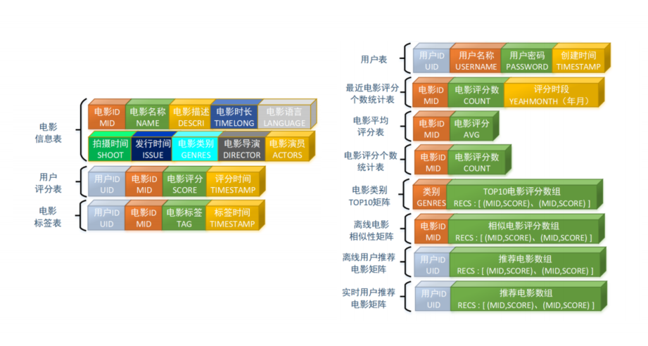

movies 电影信息

| 字段名 | 字段类型 | 字段描述 | 字段备注 |
|  ----  | ---- |  ----  | ---- |
| mid | Int | 电影的 ID |
| name | String | 电影的名称 |
| descri | String | 电影的描述 |
| timelong | String | 电影的时长 |
| shoot | String | 电影拍摄时间 |
| issue | String | 电影发布时间 |
| language | String | 电影语言 |
| genres | String | 电影所属类别 |
| director | String | 电影的导演 |
| actors | String | 电影的演员 |

ratings 用户评分信息

| 字段名 | 字段类型 | 字段描述 | 字段备注 |
|  ----  | ---- |  ----  | ---- |
| uid | Int |  用户的 ID |   |
| mid | Int |  电影的 ID |   |
| score | Double | 电影的分值 |   |
| timestamp | Long | 评分的时间 |   |

tags 电影标签信息

| 字段名 | 字段类型 | 字段描述 | 字段备注 |
|  ----  | ---- |  ----  | ---- |
| uid | Int |  用户的 ID |   |
| mid | Int |  电影的 ID |   |
| tag | String | 电影的标签 |   |
| timestamp | Long | 评分的时间 |   |

user 信息

| 字段名 | 字段类型 | 字段描述 | 字段备注 |
|  ----  | ---- |  ----  | ---- |
| uid |  Int |  用户的 ID |
|  username |  String  | 用户名 |  
|  password |  String |  用户密码 |
|  first |  boolean |  用于是否第一次登录 |
|  genres |  List<String> |  用户偏爱的电影类型 |
|  timestamp |  Long |  用户创建的时间 |

RateMoreMoviesRecently 最近电影评分个数统计表

| 字段名 | 字段类型 | 字段描述 | 字段备注 |
|  ----  | ---- |  ----  | ---- |
| mid | Int | 电影的 ID | 
| count | Int | 电影的评分数 | 
| yearmonth | String | 评分的时段|  yyyymm

RateMoreMovies 电影评分个数统计表

| 字段名 | 字段类型 | 字段描述 | 字段备注 |
|  ----  | ---- |  ----  | ---- |
| mid | Int | 电影的 ID | 
| count | Int | 电影的评分数| 

AverageMoviesScore 电影平均评分表

| 字段名 | 字段类型 | 字段描述 | 字段备注 |
|  ----  | ---- |  ----  | ---- |
|  mid |  Int |  电影的 ID |  
|  avg |  Double |  电影的平均评分 |  

MovieRecs 电影相似性矩阵

| 字段名 | 字段类型 | 字段描述 | 字段备注 |
|  ----  | ---- |  ----  | ---- |
|  mid |  Int |  电影的 ID |  |
|  recs |  Array[(mid:Int,score:Double)] |  该电影最相似的电影集合 |  |  

UserRecs 用户电影推荐矩阵

| 字段名 | 字段类型 | 字段描述 | 字段备注 |
|  ----  | ---- |  ----  | ---- |
|  uid |  Int |  用户的 ID |  |  
|  recs |  Array[(mid:Int,score:Double)] |  推荐给该用户的电影集合 |  |  

StreamRecs 用户实时电影推荐矩阵

| 字段名 | 字段类型 | 字段描述 | 字段备注 |
|  ----  | ---- |  ----  | ---- |
|  uid |  Int |  用户的 ID |  |  
|  recs |  Array[(mid:Int,score:Double)] |  实时推荐给该用户的电影集合 |  |  

GenresTopMovies 电影类别 TOP 10

| 字段名 | 字段类型 | 字段描述 | 字段备注 |
|  ----  | ---- |  ----  | ---- |
|  genres |  String |  电影类型 |  |  
|  recs |  Array[(mid:Int,score:Double)] |  TOP10 电影 |  |  

#### 统计推荐模块

#### 离线推荐模块

离线推荐服务主要分为统计性算法、基于 ALS 的协同过滤推荐算法以及基于内容推荐算法。

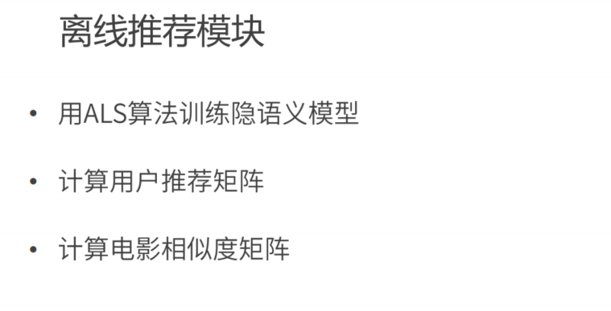

ALS (最小二乘法)

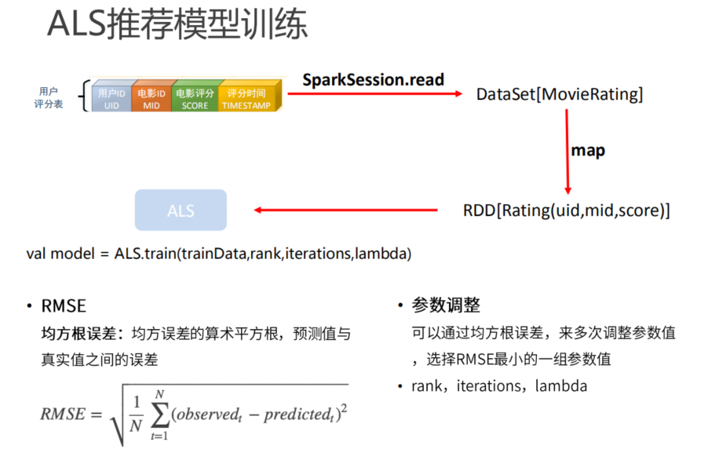

Item-Item 

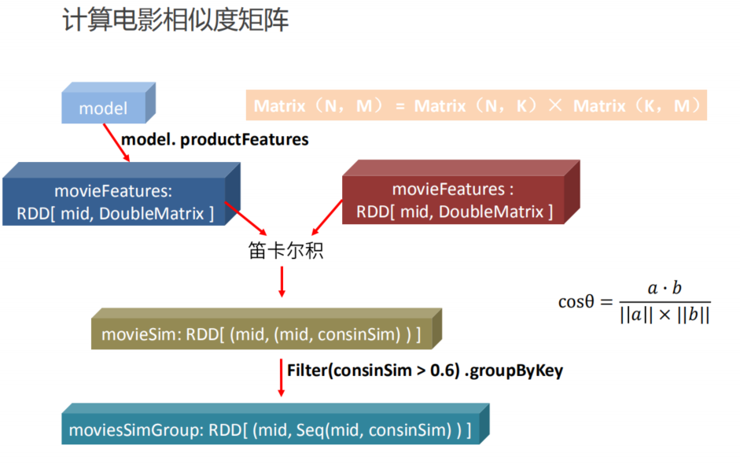

User-Item

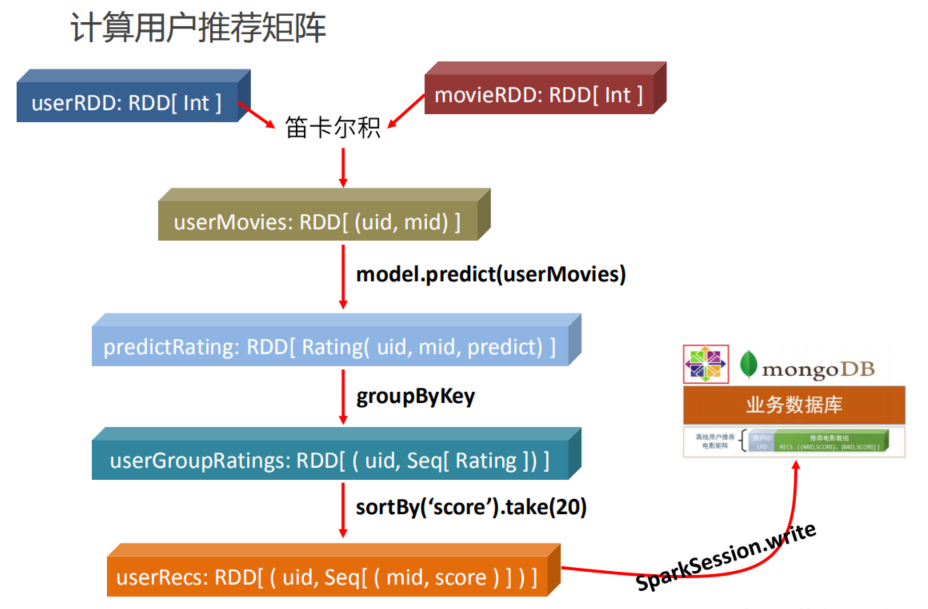

#### 实时推荐模块

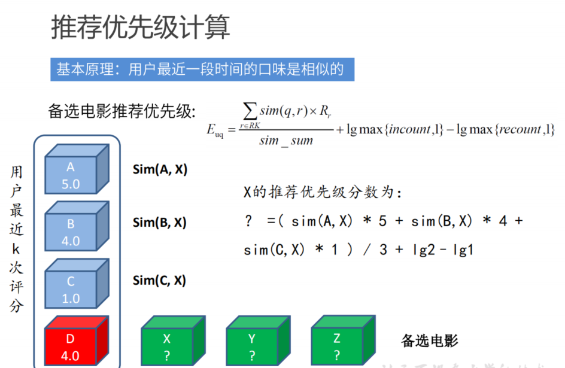

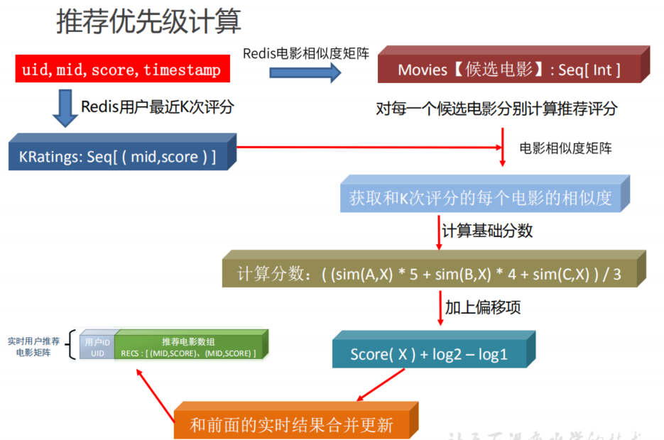

#### 基于内容的推荐模块

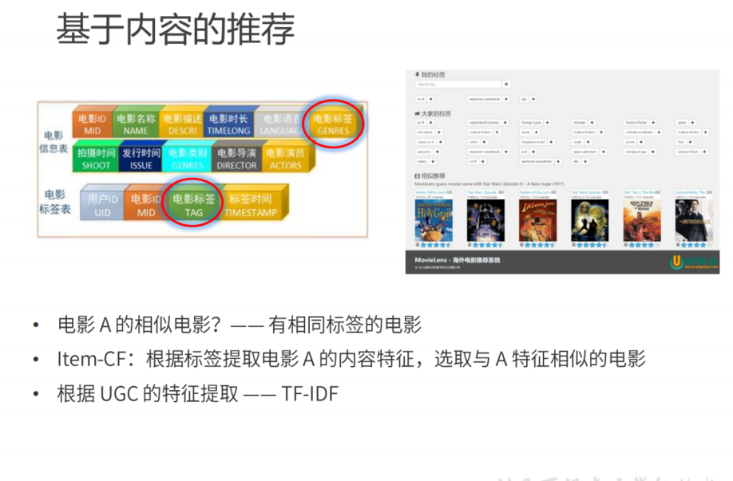

#### 混合算法推荐

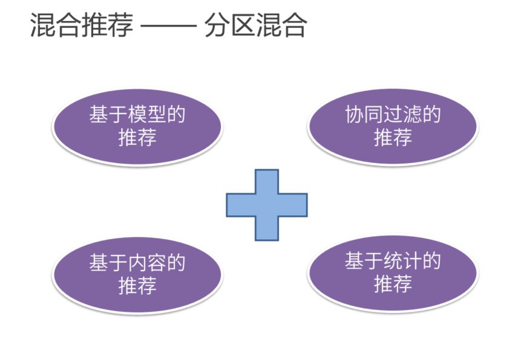

#### 其他算法

LR、中文分词、决策树

## 系统设计

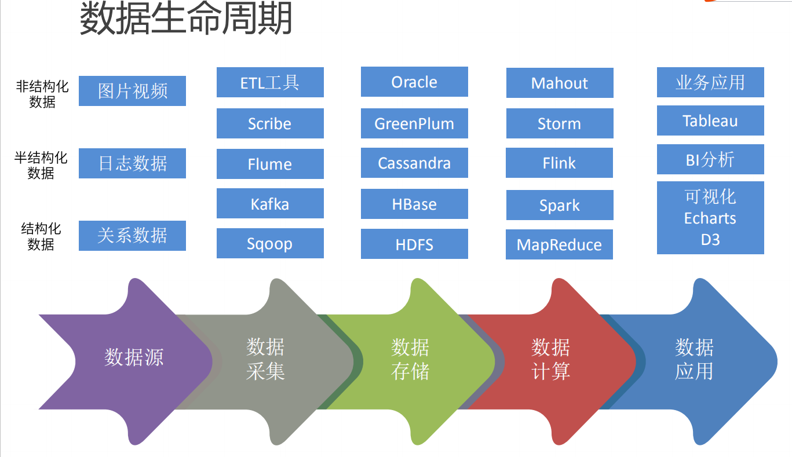

### 项目架构

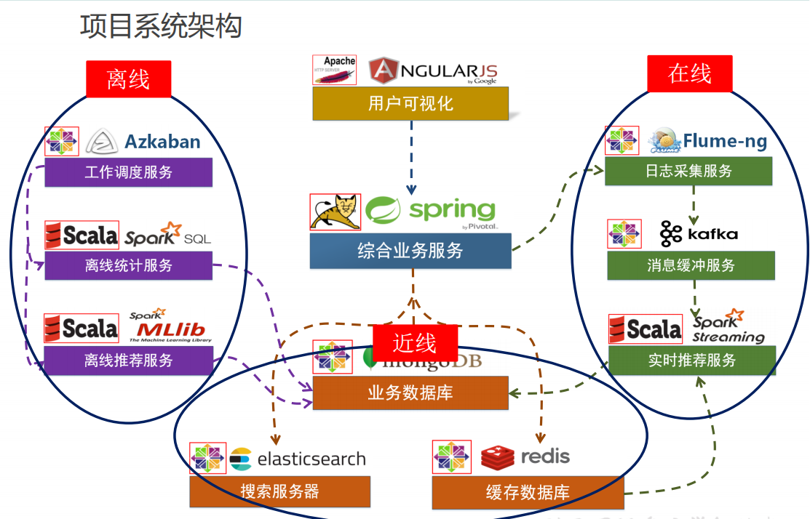

### 系统模块设计

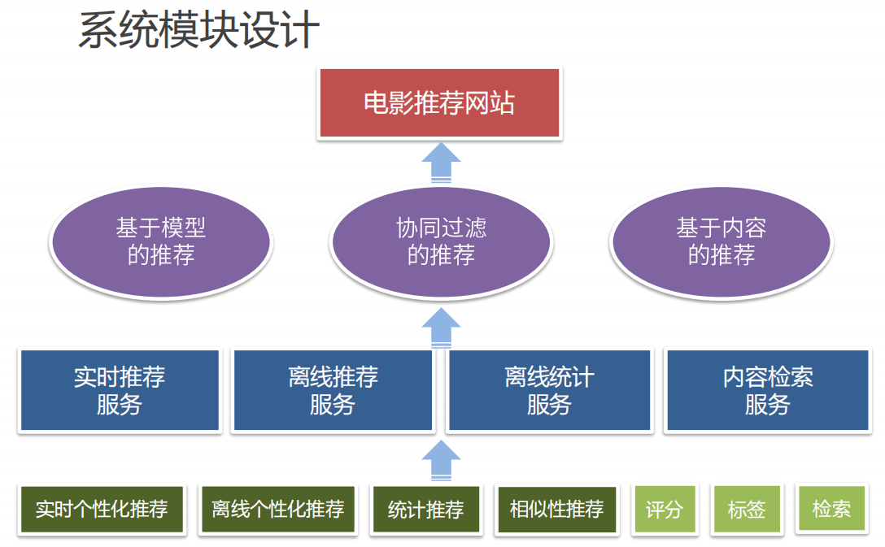

### 技术栈

## 参考

## 总结

## 下一步

如何优化？？？